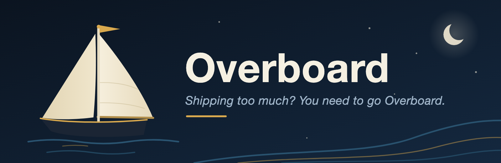

Overboard is a Claude Code plugin whose dashboard lets your Claude act as the
**CTO's assistant** — you're the CTO, the other Claude Code sessions are your
engineering team, and Overboard presents what matters across all your projects
while that team works. It shows commit activity, architecture and DB-schema
visualizations (Mermaid), your projects' real LLM prompts, **Recent work** cards
distilled from the actual diffs, and — live — the key "needs review" tidbits
from your working Claudes.

<!-- TODO: screenshot here — docs/overboard_screenshot.png -->

The dashboard is a **three-pane** layout: a condensed left sidebar lists every
project with a calendar-style activity grid (each row a week, Mon→Sun, newest
week on top — the last ~5 weeks) and any "⚑ N to review" flags; the center
becomes the selected project's detail — summary, your assistant's report,
**Recent work** review cards, recent activity, and per-repo architecture /
prompts / data-shape analysis; and a collapsible **right sidebar** is where you
(the CTO) set the project's **launch/milestone** (type, action, target date,
goals — with push-back history) and **vision/direction**. The `/overboard`
assistant reads that context to sharpen its reports and flag slipping launches.

**No Anthropic API key.** All the AI (summaries, digests, work reviews,
architecture) is done by the `/overboard` assistant itself — on your **Max/Pro
subscription**, not the metered API. You run `/overboard`, Claude launches the
dashboard and brings the board up to date — a couple of passes if there's a
backlog to analyze, then it **stops**. It's an on-demand sweep, not a background
loop that keeps polling; run `/overboard` again whenever you want a fresh
update. The dashboard is a pure viewer.

**No install, no dependencies.** Overboard runs on the Python 3 **standard
library only** — no venv, no `pip install`, no API key. Anywhere `python3`
exists (Linux, macOS) it just works. Claude Code's `${CLAUDE_PLUGIN_ROOT}`
handles the paths, so it's portable across machines with zero config.

**No tokens required, either.** Local-only mode reads commits straight from the
git clones already on your machine (`git log`, no API at all) — you can run the
whole board without a single credential, then add GitHub/Bitbucket later for
the cross-machine view.

It has two parts in one repo:

1. **The plugin** Claude Code loads — hooks that observe your sessions, an MCP
   server the assistant reads inputs from and writes results to, the `/overboard`
   command, the `cto-assistant` skill, and two read-only subagents
   (`repo-analyst`, `work-reviewer`) it delegates per-repo digging to.
2. **The dashboard** — a tiny stdlib `http.server` you view in a browser (or a
   native window if you happen to have `pywebview` installed). Key-free.

## How it works

```
 Working Claude A ─┐  Stop / SubagentStop / PostToolUse hooks  (async, never blocks)
 Working Claude B ─┼─▶ hooks/emit_event.py ─▶ ~/.cache/overboard/events.jsonl
 Working Claude C ─┘                                  │
 Bitbucket / GitHub APIs ─┬─▶ perform_refresh ─▶ state.json ┤  (deterministic, key-free)
 local git clones ────────┘                           │
                                                      ▼
  /overboard assistant (Max sub) ── reads via MCP ──▶ thinks ──▶ writes ai.json
                                                      ▼
                         dashboard = pure viewer: overlays ai.json on state.json →
                           summaries + activity grids + "needs review" + Recent
                           work cards + Mermaid architecture / ER diagrams
```

The assistant is **event-gated**: `get_pending_work` only returns projects that
changed (new finished work, or new commits), so idle projects cost nothing — not
even a Max-sub turn. Heavy analysis is additionally **budget-throttled**: only a
couple of projects get the in-depth treatment (panel extraction, first work
reviews) per half-hour window, so a fresh install trickles in over a few passes
instead of analyzing every repo at once. The in-depth work is delegated to two
bundled subagents — **`repo-analyst`** (extracts a repo's real prompts, setup
steps, key snippets, and architecture from its local clone) and
**`work-reviewer`** (clusters what recently landed into the "Recent work"
cards). API providers are the cross-machine baseline, so work you did on other
machines and pushed still shows up.

**Four files, no write races:** the dashboard owns `state.json`; the assistant
owns `ai.json`; your launch/vision context lives in `context.json` (written only
by the dashboard UI — the assistant reads it, never writes); `events.jsonl` is
append-only. The dashboard reads `ai.json` but never writes it, and the
assistant's MCP server never writes `state.json`.

## Setup (once)

There's nothing to install and — in Local-only mode — nothing to configure. On
first launch the dashboard auto-opens a short **onboarding wizard**: pick any
combination of sources (they merge into one board):

- **Local git** — key-free; discovers the clones under your project folders and
  reads commits with `git log`. The fastest way to start on a fresh machine.
- **GitHub** — a personal access token (classic with `repo` scope, or
  fine-grained with repository **contents + metadata, read**). Pulls the repos
  you own, including commits pushed from other machines.
- **Bitbucket** — workspace + Atlassian email + an API token.

Returning users manage the same sources in the **⚙ Settings** panel. Everything
is saved to `~/.cache/overboard/credentials.json` (mode `0600`, machine-local,
so it survives a plugin reinstall). Tokens are never sent back to the browser.

A legacy `.env` at the repo root still works as a Bitbucket fallback and is
migrated into the credentials file on first save:

```
ATLASSIAN_EMAIL=you@example.com
BITBUCKET_API_TOKEN=xxxxxxxx
```

No `ANTHROPIC_API_KEY` — the `/overboard` agent does all AI on your Max/Pro sub.
Requires `python3` 3.9+ on your PATH (stock macOS and any recent Linux qualify). That's it.

## Install the plugin in Claude Code

Clone this repo anywhere, then:

```
/plugin marketplace add /path/to/overboard-plugin
/plugin install overboard@overboard-marketplace
```

Restart Claude Code (a full quit/relaunch, not just `/reload-plugins`) so it
launches the MCP server with the current config. Validate with `/plugin
validate`; check `/mcp` shows **overboard ✔ connected**. Once enabled, its hooks
observe every Claude Code session you run.

**Porting to another machine (e.g. your Mac):** copy the folder, add the
marketplace there, install, and run the onboarding wizard (Local-only needs no
credentials at all). No venv, no deps, no path edits — `${CLAUDE_PLUGIN_ROOT}`
and `python3` resolve per-machine.

## Run it

From Claude Code, **`/overboard`** opens the dashboard and runs update passes
until the backlog is drained, then stops — run it again whenever you want a
fresh sweep. To run the dashboard directly:

```sh
python3 -m overboard.app          # serve dashboard, open browser (native window if pywebview present)
python3 -m overboard.app --once   # headless refresh, print, exit
```

It serves a browser dashboard at `http://localhost:8787`. Deterministic content
(commit activity grids, local badges, static prompt/DB fallback scans, Mermaid
ER + structure) always shows, and each local clone's static analysis runs
**automatically** in the background — no button to click. The good stuff
(summaries, Recent work cards, real prompts, architecture write-ups) fills in
once `/overboard` has run. **Refresh** re-pulls commits; **Rescan** re-discovers
local clones.

## MCP tools (the assistant's hands)

The `/overboard` assistant drives everything through the bundled MCP server (key-free
— the tools just read deterministic data and persist JSON):

- **Read:** `get_pending_work()` (the to-do list), `list_projects()`,
  `get_commits(slug, limit)`, `get_recent_diff(slug)` (real diff for repos with
  no local clone on this machine), `get_repo_analysis(slug)`,
  `get_project_events(project, limit)`,
  `get_project_context(project)` (the CTO's launch + vision, read-only).
- **Write:** `set_project_summary(project, text)`,
  `record_digest(project, narrative, review)`,
  `record_work_review(project, units)` (the "Recent work" cards),
  `set_architecture(slug, text, mermaid)`, `set_prompts(slug, items)`,
  `set_setup(slug, text)`, `set_snippets(slug, items)`,
  `set_data_shape(slug, ...)`, `set_grouping(groups)` (how repos cluster into
  named projects), `flag_for_review(project, note)`, `record_status(project, note)`.
- **Dashboard:** `launch_dashboard()` — start the dashboard server, return its URL.

The `cto-assistant` skill is the assistant's full playbook (routine + writing
style + the event-gated loop rule); the `repo-analyst` and `work-reviewer`
subagents do the per-repo reading and return JSON for the assistant to persist.
Any working Claude can also call `flag_for_review` to raise something ad hoc.

## Configuration

Sources & tokens live in the **⚙ Settings** panel (→
`~/.cache/overboard/credentials.json`). The commit window (how many days of
inactivity before a repo drops off the board) is adjustable in Settings too.
Non-secret app defaults are in `overboard/projects.json` —
`refresh_interval_minutes`, `commit_window_days`, and optional `local_roots`
(defaults include `~/projects`, `~/code`, `~/Developer`, …) for where local
clones are discovered (both `bitbucket.org` and `github.com` clones under those
roots are matched). Files under `~/.cache/overboard/`: `credentials.json` (sources/tokens),
`state.json` (dashboard-owned: commits, analysis, local links, activity),
`ai.json` (agent-owned: summaries, digests, work reviews, architecture/prompts/
setup/snippets), `context.json` (CTO-owned: per-project launch/milestone + vision),
`events.jsonl` (append-only activity log). Delete any to reset that piece.

## Debug helpers

```sh
python3 -m overboard.localrepo                       # discovered local clones (all sources)
python3 -m overboard.analysis <slug>                 # static analysis of one local repo
python3 -m overboard.bitbucket <slug> <branch>       # raw Bitbucket commit fetch
python3 -m overboard.github <owner> <repo> <branch>  # raw GitHub commit fetch
python3 overboard/mcp_server.py                      # run the MCP server (stdio)
```

## License

[MIT](LICENSE)
