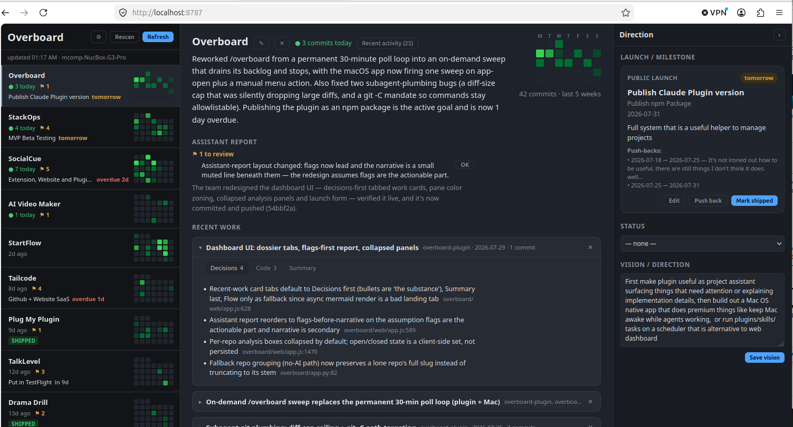

Overboard is a Claude Code plugin whose dashboard lets your Claude act as the
**CTO's assistant** — you're the CTO, the other Claude Code sessions are your
engineering team, and Overboard presents what matters across all your projects
while that team works. It shows commit activity, architecture and DB-schema
visualizations (Mermaid), your projects' real LLM prompts, **Recent work** cards
distilled from the actual diffs, and — live — the key "needs review" tidbits
from your working Claudes. Key-free by design: Python standard library only (no
venv, no `pip install`), and all the AI runs on your Claude Code subscription —
no `ANTHROPIC_API_KEY`.



The dashboard is a **three-pane** layout: a condensed left sidebar lists every
project with a calendar-style activity grid (each row a week, Mon→Sun, newest
week on top — the last ~5 weeks) and any "⚑ N to review" flags; the center
becomes the selected project's detail — summary, your assistant's report,
**Recent work** review cards, recent activity, and per-repo architecture /
prompts / data-shape analysis; and a collapsible **right sidebar** is where you
(the CTO) set the project's **launch/milestone** (type, action, target date,
goals — with push-back history) and **vision/direction**. The `/overboard`
assistant reads that context to sharpen its reports and flag slipping launches.

## Install the plugin in Claude Code

From the [Productive Mark marketplace](https://github.com/mrieck/claude-plugins):

```
/plugin marketplace add mrieck/claude-plugins
/plugin install overboard@productive-mark
```

Or from a local clone of this repo (it bundles its own marketplace):

```
/plugin marketplace add /path/to/overboard-plugin
/plugin install overboard@overboard-marketplace
```

Restart Claude Code (a full quit/relaunch, not just `/reload-plugins`) so it
launches the MCP server with the current config. Check `/mcp` shows
**overboard ✔ connected**. Requires `python3` 3.9+ on your PATH (stock macOS
and any recent Linux qualify).

## Run it

From Claude Code, **`/overboard`** opens the dashboard and runs update passes
until the backlog is drained, then stops — run it again whenever you want a
fresh sweep. To run the dashboard directly:

```sh
python3 -m overboard.app          # serve dashboard, open browser (native window if pywebview present)
python3 -m overboard.app --once   # headless refresh, print, exit
```

It serves a browser dashboard at `http://localhost:8787`. On first launch a
short onboarding wizard picks your sources; local clones are then discovered
and analyzed automatically. The good stuff (summaries, Recent work cards, real
prompts, architecture write-ups) fills in once `/overboard` has run.
**Refresh** re-pulls commits; **Rescan** re-discovers local clones.

## Configuration

Out of the box, **Local-only mode** needs no credentials at all — it reads
commits straight from the git clones on your machine with `git log`. Add a
**GitHub** token (classic with `repo` scope, or fine-grained with repository
**contents + metadata, read**) or a **Bitbucket** API token (workspace +
Atlassian email) in **⚙ Settings** to also include commits you pushed from
other machines — every source merges into the same board.

Tokens are saved to `~/.cache/overboard/credentials.json` (mode `0600`,
machine-local) and never sent back to the browser. The commit window (how many
days of inactivity before a repo drops off the board) is adjustable in Settings
too. Non-secret app defaults are in `overboard/projects.json` —
`refresh_interval_minutes`, `commit_window_days`, and optional `local_roots`
(defaults include `~/projects`, `~/code`, `~/Developer`, …) for where local
clones are discovered. Other files under `~/.cache/overboard/`: `state.json`
(commits, analysis, activity), `ai.json` (the assistant's summaries and
write-ups), `context.json` (your launches + vision), `events.jsonl`
(append-only activity log). Delete any to reset that piece.

## License

[MIT](LICENSE)
