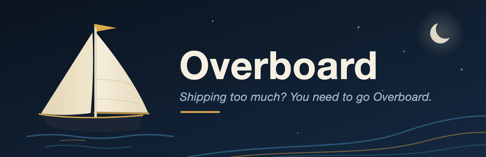
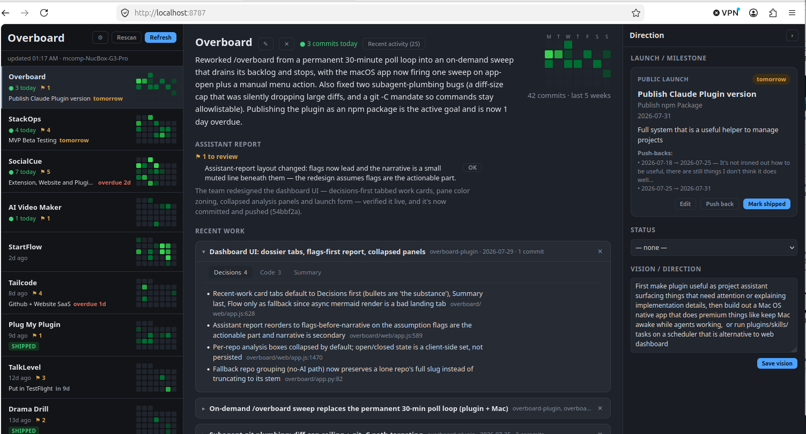

Overboard is a Claude Code plugin that watches every Claude Code session across
all your repos and reports what shipped — on the Claude subscription you already
have. One `/overboard` session becomes your assistant: it keeps a browser
dashboard current and flags the few things that need you. It shows commit activity, architecture and DB-schema
visualizations (Mermaid), your projects' real LLM prompts, **Recent work** cards
distilled from the actual diffs, and — live — the key "needs review" tidbits
from your working Claudes. Key-free by design: Python standard library only (no
venv, no `pip install`), and all the AI runs on your Claude Code subscription —
no `ANTHROPIC_API_KEY`.



The dashboard has a thin **panel strip** on the far left — **Projects ·
Scheduler · Plugins**, Settings pinned at the bottom (keys `1` `2` `3`; the
URL hash deep-links every panel: `#/projects/<name>`, `#/scheduler`,
`#/scheduler/run/<id>`, `#/plugins`, `#/settings/<page>`).

**Projects** is the **three-pane** board: a condensed left sidebar lists every
project with a calendar-style activity grid (each row a week, Mon→Sun, newest
week on top — the last ~5 weeks) and any "⚑ N to review" flags; the center
becomes the selected project's detail — summary, your assistant's report,
**Recent work** review cards, recent activity, and per-repo architecture /
prompts / data-shape analysis; and a collapsible **right sidebar** is where you
set the project's **launch/milestone** (type, action, target date,
goals — with push-back history) and **vision/direction**. The `/overboard`
assistant reads that context to sharpen its reports and flag slipping launches.
**Scheduler** and **Plugins** take the full width (below).

## Install the plugin in Claude Code

From the [Productive Mark marketplace](https://github.com/mrieck/claude-plugins):

```
/plugin marketplace add mrieck/claude-plugins
/plugin install overboard@productive-mark
```

Or from a local clone of this repo (it bundles its own marketplace):

```
/plugin marketplace add /path/to/overboard-plugin
/plugin install overboard@overboard-marketplace
```

Restart Claude Code (a full quit/relaunch, not just `/reload-plugins`) so it
launches the MCP server with the current config. Check `/mcp` shows
**overboard ✔ connected**. Requires `python3` 3.9+ on your PATH (stock macOS
and any recent Linux qualify).

## Run it

From Claude Code, **`/overboard`** opens the dashboard and runs update passes
until the backlog is drained, then stops — run it again whenever you want a
fresh sweep. To run the dashboard directly:

```sh
python3 -m overboard.app          # serve dashboard, open browser (native window if pywebview present)
python3 -m overboard.app --once   # headless refresh, print, exit
```

It serves a browser dashboard at `http://localhost:8787`. On first launch a
short onboarding wizard picks your sources; local clones are then discovered
and analyzed automatically. The good stuff (summaries, Recent work cards, real
prompts, architecture write-ups) fills in once `/overboard` has run.
**Refresh** re-pulls commits; **Rescan** re-discovers local clones.

## Scheduler

The **Scheduler** panel runs recurring, unattended Claude Code sessions —
"nightly triage at 2am", "every 2h between 9–18", "once, tonight at 11" —
without the Mac app. It is laid out like the Mac app's: a **10-day agenda** on
the left (every upcoming fire, click one to open its agent), **Agents | History**
in the middle, and a permanent **editor** on the right (or the picked run's
detail). Each *agent* (a slot) has a name, a command/prompt, a working folder
(or a linked task workspace), a simple schedule (daily / weekly / every N hours
/ once — deliberately simpler than cron), a timeout and an enabled switch. The
prompt field completes `/slash-commands` (yours, the project's, every installed
plugin's commands and skills) and `~/` `./` `/` paths, and warns when the
command's plugin isn't enabled in that folder — with an **Enable** button.

Runs launch inside [Herdr](https://herdr.dev) (macOS and Linux) as
`claude --permission-mode auto`, one workspace per project (named after the
project folder) with one tab per run named after the task, so you can watch
or take over any run in Herdr's own UI. Each run is identified by its own
Claude session (captured from the SessionStart hook), so a session of yours in
the same folder is never mistaken for it; when the run's Stop hook fires — and
no subagent it spawned is still working — the scheduler captures the closing
message and transcript, then closes the pane. A fresh `claude` in a
never-trusted folder blocks on the folder-trust dialog; the scheduler answers
that one dialog (once per run) and nothing else — any other prompt shows as
**waiting for input**. **Take over** focuses the session in Herdr and stops
managing it (no auto-`/exit`, the pane stays yours). **History** shows what each
run *reported* — the closing message as prose — with the raw terminal capture
behind a disclosure; hide, remove or clear runs. A **once** agent disables
itself after it fires. **Concurrent runs** (1–8) and the default timeout are in
Settings ▸ Misc; an agent never overlaps its own next firing. Queued runs
survive a dashboard restart (a run that waited past its 30-minute window is
skipped, not run stale). State lives in `~/.cache/overboard/scheduler/`.

## Dispatcher

Top-left of the Scheduler panel: type **what should get done** ("add a
changelog entry to project X for this week's commits") and press Dispatch. A
short-lived `/overboard:dispatch` session reads the request, works out the
project (via the plugin's `list_projects`), the prompt and the time, and
answers with a task — the scheduler runs it (now, or as a **once** agent for
later), and the result (the worker writes a `result.json` into a task folder
granted via `--add-dir`: summary, files, links) lands in the **Recent
dispatches** feed, each with a `#id`. The dispatcher may also `reply` from the
task ledger ("what's running?") or `reject` a non-task. Follow-ups ("make it
shorter") rebuild the task's context into a fresh session. It needs an
**Overboard run directory** (Settings ▸ Misc) — your workspace root, where new
project folders may be created. State lives in `~/.cache/overboard/dispatch/`.

Dispatching **from your phone** (Telegram, Slack next) is
[Overboard for Mac](https://tryoverboard.com)'s feature; the dashboard's
dispatcher is browser-only by design.

Tests: `python3 -m unittest discover -s tests` (stdlib only). To run the
dashboard against a copy of someone else's state without touching your own,
point it at another folder: `OVERBOARD_STATE_DIR=/path python3 -m overboard.app`.

Slots fire only while the dashboard server is running. On an always-on Linux
box, run it as a systemd user service:

```ini
# ~/.config/systemd/user/overboard.service
[Unit]
Description=Overboard dashboard + scheduler

[Service]
ExecStart=/usr/bin/python3 -m overboard.app --serve --no-open
WorkingDirectory=%h/.claude/plugins/overboard   # wherever the plugin checkout lives
Restart=on-failure

[Install]
WantedBy=default.target
```

```sh
systemctl --user enable --now overboard
loginctl enable-linger $USER   # keep it running when you're logged out
```

## Configuration

Out of the box, **Local-only mode** needs no credentials at all — it reads
commits straight from the git clones on your machine with `git log`. Add a
**GitHub** token (classic with `repo` scope, or fine-grained with repository
**contents + metadata, read**) or a **Bitbucket** API token (workspace +
Atlassian email) in **Settings ▸ Sources** to also include commits you pushed from
other machines — every source merges into the same board.

Tokens are saved to `~/.cache/overboard/credentials.json` (mode `0600`,
machine-local) and never sent back to the browser. The commit window (how many
days of inactivity before a repo drops off the board) is adjustable in Settings
too. Non-secret app defaults are in `overboard/projects.json` —
`refresh_interval_minutes`, `commit_window_days`, and optional `local_roots`
(defaults include `~/projects`, `~/code`, `~/Developer`, …) for where local
clones are discovered. Other files under `~/.cache/overboard/`: `state.json`
(commits, analysis, activity), `ai.json` (the assistant's summaries and
write-ups), `context.json` (your launches + vision), `events.jsonl`
(append-only activity log). Delete any to reset that piece.

## License

[MIT](LICENSE)
